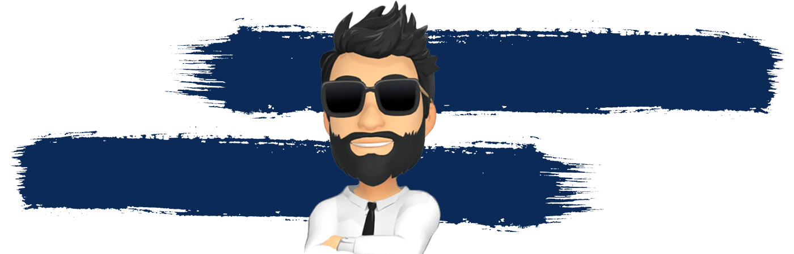

<h4 align="right">Visitor's count :eyes:</h4>


## For those who do 😎

I do what I want. People who deserve will get the respect! I'm not arrogant but I'm proud of myself!
<!--
**NaviRocker/NaviRocker** is a ✨ _special_ ✨ repository because its `README.md` (this file) appears on your GitHub profile.

Here are some ideas to get you started:

- 🔭 I’m currently working on ...
- 🌱 I’m currently learning ...
- 👯 I’m looking to collaborate on ...
- 🤔 I’m looking for help with ...
- 💬 Ask me about ...
- 📫 How to reach me: ...
- 😄 Pronouns: ...
- ⚡ Fun fact: ...
-->

### ⚙️ &nbsp;GitHub Personal Statistics

<p align="center">
<a href="https://github.com/NaviRocker">
  
  
</a>
</p>

### 🏆 &nbsp;GitHub Personal Achievements

<p align="center">
<a href="https://github.com/NaviRocker">
  
</a>
</p>

### 🏆 Github Statistics

<!--START_SECTION:waka-->
```text
PHP        1 hr 35 mins    █████████████████▒░░░░░░░   69.69 % 
C          27 mins         █████░░░░░░░░░░░░░░░░░░░░   19.81 % 
HTML       6 mins          █▒░░░░░░░░░░░░░░░░░░░░░░░   04.72 % 
CSS        6 mins          █░░░░░░░░░░░░░░░░░░░░░░░░   04.50 % 
Markdown   1 min           ▒░░░░░░░░░░░░░░░░░░░░░░░░   01.08 % 
```
<!--END_SECTION:waka-->

### 🤝🏻 &nbsp;Connect with Me

<p align="center">
<a href="https://code2climb.com"></a>
<a href="https://www.linkedin.com/in/naviir/"></a>
<a href="mailto:naveen.sack@gmail.com"></a>
<a href="https://instagram.com/navii__x"></a>
<a href="https://www.facebook.com/NaviiRocker/"></a>
<a href="https://www.gitlab.com/NaviRocker"></a>
</p>

### 📕 My Latest Blog posts:

- [Inside Google Headquarters in Silicon Valley](https://code2climb.com/posts/inside-google-headquarters-in-silicon-valley/)
- [Elon Musk: A Sensational Man in a Roller Coaster Ride](https://code2climb.com/posts/elon-musk-a-sensational-man-in-a-roller-coaster-ride/)
- [Cristiano Ronaldo: The Survival of the Fittest](https://code2climb.com/posts/cristiano-ronaldo-the-survival-of-the-fittest/)
- [First Time Flying Experience in an Airplane](https://code2climb.com/posts/first-time-flying-experience-in-an-airplane/)
